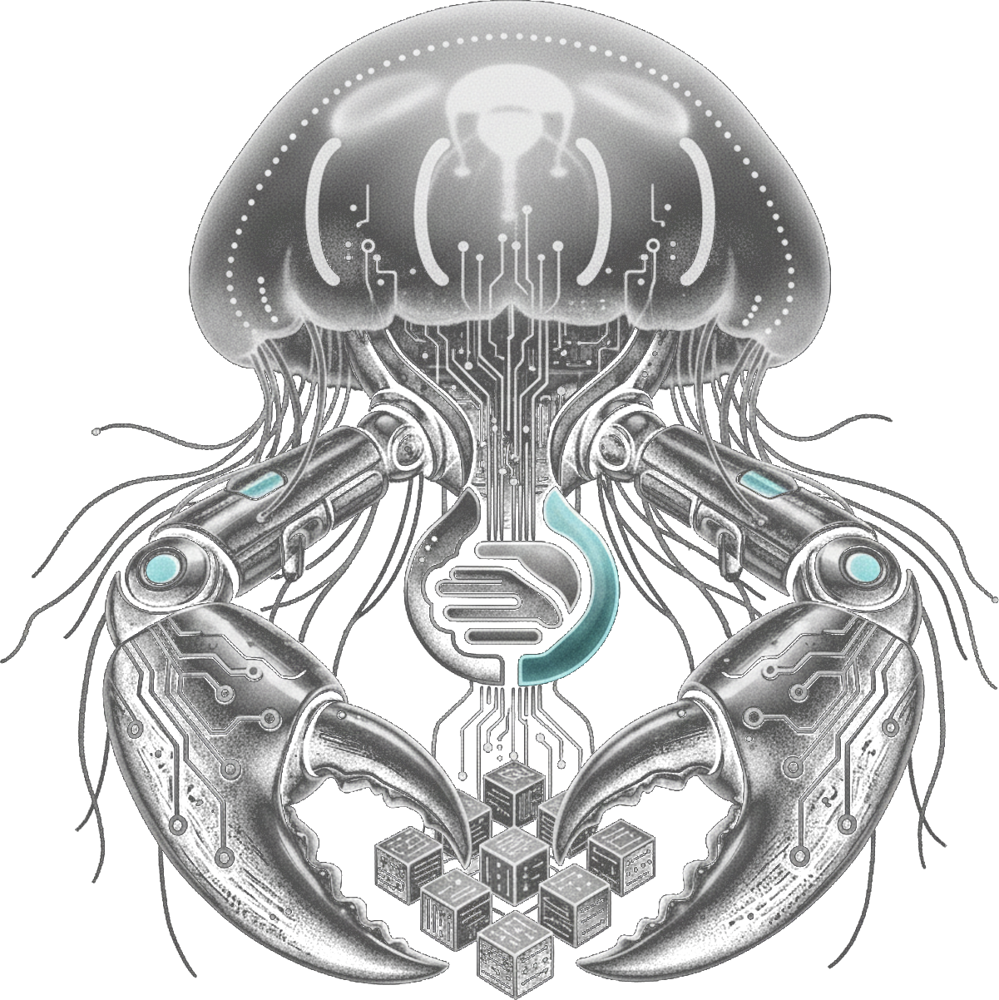

# HybridClaw

[](https://github.com/HybridAIOne/hybridclaw/actions/workflows/ci.yml)
[](https://github.com/HybridAIOne/hybridclaw/actions/workflows/ci.yml)
[](https://www.npmjs.com/package/@hybridaione/hybridclaw)
[](https://nodejs.org/en/download)
[](https://github.com/HybridAIOne/hybridclaw/blob/main/LICENSE)
[](https://www.hybridclaw.io/docs/)
[](https://hybridai.one)
[](https://discord.gg/jsVW4vJw27)



## All of the Claw, None of the Chaos
### Enterprise-ready self-hosted AI assistant runtime

HybridClaw is a self-hosted AI assistant runtime for teams that need control,
security, and operational visibility. It combines sandboxed execution, secure
credentials, approvals, persistent memory, and admin surfaces behind a single
gateway.

Connect it to Discord, Slack, WhatsApp, Telegram, Microsoft Teams, email,
Twilio voice, or the web. Run it locally, deploy it for business workflows,
and keep your agents, secrets, and data under your control.

[Quick Start](https://www.hybridclaw.io/docs/getting-started/quickstart) ·
[Installation](https://www.hybridclaw.io/docs/getting-started/installation) ·
[Configuration](https://www.hybridclaw.io/docs/reference/configuration) ·
[Migration](https://www.hybridclaw.io/docs/reference/commands#migration) ·
[Contributing](./CONTRIBUTING.md) ·
[Support](./SUPPORT.md)

## Pick your path

- Want the shortest path to a running assistant? Start with
  [Quick Start](https://www.hybridclaw.io/docs/getting-started/quickstart).
- Want the full setup flow with providers, channels, and admin surfaces? Start
  with [Installation](https://www.hybridclaw.io/docs/getting-started/installation)
  and [Authentication](https://www.hybridclaw.io/docs/getting-started/authentication).
- Want to migrate from OpenClaw or Hermes? Start with the
  [migration commands](https://www.hybridclaw.io/docs/reference/commands#migration).
- Want to contribute from source? Start with [CONTRIBUTING.md](./CONTRIBUTING.md)
  and the maintainer docs under [docs/content/README.md](./docs/content/README.md).

## Coming from OpenClaw or Hermes?

```bash
hybridclaw migrate openclaw --dry-run
hybridclaw migrate hermes --dry-run
```

Preview and import compatible state from OpenClaw or Hermes in minutes.
Imports compatible skills, memory, config, and optional secrets.

## HybridAI Platform Advantage

HybridClaw is the runtime. HybridAI is the (optional) platform layer around it.

HybridAI adds:

- one-click cloud deployment
- enterprise shared RAG / knowledge
- access to current models from Anthropic, OpenAI, Google, xAI, and others
- observability across multiple agents
- built-in email addresses for your agents
- ready-to-run virtual coworkers

## Get running in 2 minutes

```bash
npm install -g @hybridaione/hybridclaw
hybridclaw onboarding
hybridclaw gateway
hybridclaw tui
```

Open locally:

- Chat UI: `http://127.0.0.1:9090/chat`
- Admin UI: `http://127.0.0.1:9090/admin` for channels, versioned agent files,
  scheduler, audit, config, and channel-specific instructions
- Agents UI: `http://127.0.0.1:9090/agents`
- OpenAI-compatible API: `http://127.0.0.1:9090/v1/models` and `http://127.0.0.1:9090/v1/chat/completions`

Requirement: Node.js 22 (Docker recommended for sandbox)

Release notes live in [CHANGELOG.md](./CHANGELOG.md), and the browsable
operator and maintainer manual lives at
[hybridclaw.io/docs](https://www.hybridclaw.io/docs/).

## See it in Action

Once the gateway is running, open HybridClaw locally:

- Web Chat: `http://127.0.0.1:9090/chat`
- Admin Console: `http://127.0.0.1:9090/admin` for channels, versioned agent files,
  scheduler, audit, config, and channel-specific instructions
- Agent Dashboard: `http://127.0.0.1:9090/agents`
- or connect Slack, WhatsApp, Telegram, Discord, Microsoft Teams, Email

## Operator workflows

- `hybridclaw gateway status` reports sandbox/runtime details, and in
  container mode it includes the configured image name plus the resolved
  version and short image id.
- `hybridclaw update --yes` upgrades a global npm install and auto-restarts a
  running local gateway with its original launch parameters when possible,
  falling back to `hybridclaw gateway restart` if not.
- `/admin/agents` edits allowlisted bootstrap markdown files such as
  `AGENTS.md`, keeps saved revisions, and restores earlier versions from the
  browser.
- `/admin/channels` edits transport config, encrypted channel credentials,
  Twilio voice settings, and per-channel instructions that are injected into
  prompts at runtime.
- `/admin/approvals` manages approval policies from the browser.
- `/admin/gateway` reloads runtime config and refreshes secrets from the
  browser without tearing down the enclosing workspace container; keep
  `hybridclaw gateway restart` for local/manual full restarts.
- `hybridclaw tui` includes a keyboard-driven approval picker and prints a
  ready-to-run `hybridclaw tui --resume <sessionId>` command on exit.
- `hybridclaw doctor` checks runtime health including resource hygiene
  maintenance for stale gateway artifacts.
- `hybridclaw onboarding` and related local setup flows can restore the last
  known-good saved config snapshot or roll back to a tracked revision when
  `config.json` becomes invalid.
- `hybridclaw skill import` supports community sources, local directories,
  and `.zip` archives.
- `hybridclaw eval hybridai-skills` turns the bundled skills pages' "Try it
  yourself" prompts into a local eval suite, and live summaries surface the
  observed skill, artifact presence, and counted tool-call totals.
- Channel delivery stays predictable: email seeds its first mailbox cursor from
  the current head instead of replaying old inbox mail, retry-aware transports
  honor server `Retry-After` backoff, and WhatsApp startup avoids intermittent
  init-query bad-request failures.

## Models, Skills, and Memory

- `hybridclaw auth login` and `/model list` cover HybridAI, Codex, OpenRouter,
  Mistral, Hugging Face, Gemini, DeepSeek, xAI, Z.AI, Kimi, MiniMax,
  DashScope, Xiaomi, Kilo Code, and local backends such as Ollama, LM Studio,
  llama.cpp, and vLLM. Remote OpenAI-compatible providers can merge
  runtime-discovered model catalogs with operator-pinned lists.
- Skills can be enabled or disabled globally or per channel from
  `hybridclaw skill enable|disable`, TUI `/skill config`, or the admin
  `Skills` page.
- Built-in memory can stay standalone or layer with ByteRover, Mem0, Honcho,
  MemPalace, QMD, and GBrain plugins depending on whether you want
  local-first recall, hosted memory, or domain-specific retrieval.
- Optional OpenTelemetry tracing exports gateway and agent spans to OTLP
  backends and annotates structured logs with trace ids for cross-system
  correlation.

## How HybridClaw compares

| Capability | HybridClaw | OpenClaw | Hermes Agent |
| --- | --- | --- | --- |
| Self-hosted runtime | ✅ Gateway + sandboxed container runtime | ✅ Self-hosted gateway/runtime | ✅ Self-hosted gateway/runtime |
| Migration support | ✅ Imports from OpenClaw and Hermes | ❌ No comparable import path surfaced | ⚠️ Imports from OpenClaw only |
| Encrypted secrets | ✅ Encrypted store + SecretRefs | ⚠️ SecretRefs, not a built-in encrypted store | ⚠️ File-permission-based secret storage |
| Approvals / governance | ✅ Approvals, audit trails, sandbox, config history | ⚠️ Strong approvals/audit, less enterprise-governance framing | ⚠️ Strong approvals/isolation, less audit/admin surface |
| Memory / knowledge | ✅ Shared memory + HybridAI knowledge path | ⚠️ Strong memory/session features | ⚠️ Strong persistent/self-improving memory |
| Multi-agent observability | ✅ Built-in audit surfaces + platform path | ⚠️ Multi-agent/task inspection exists | ⚠️ Subagents + logs/session search, not central observability |
| Local + cloud deployment model | ✅ Local-first runtime with HybridAI cloud path plus SSH/Tailscale remote access | ⚠️ Self-hosted + remote access | ✅ Local, VPS, Docker, Modal, Daytona |
| Multiple UIs | ✅ TUI + Chat UI + Admin UI + Agents UI | ✅ TUI + WebChat + Control UI | ⚠️ TUI + messaging + API server, no comparable built-in admin/chat web UI |

## Adjacent tools

| Comparison point | HybridClaw | LangChain | n8n |
| --- | --- | --- | --- |
| Framework vs runtime | Runtime | Framework | Workflow builder |
| Coding required | Low to medium | High | Low |
| Workflow builder vs agent runtime | Agent runtime | Framework for building agent systems | Visual workflow builder |
| Enterprise controls | ✅ Approvals, audit, sandbox, encrypted secrets | ⚠️ You build them | ⚠️ Workflow-level controls |

## Security and governance built in

- secure credential storage
- sandboxed execution
- approvals
- audit trails with hash chain
- config versioning and backup/rollback
- observability

## Built for real workflows

- channels
- versioned agent workspace prompt files with saved revisions and restore
- browser sessions
- office docs
- skills / plugins / MCP
- persistent workspaces

## Built for rollout and migration

- import from OpenClaw / Hermes
- portable `.claw` packages with bundled knowledge and skills
- local-first to cloud-ready path

## Architecture

- **Gateway service** (Node.js) — shared message/command handlers, SQLite persistence (KV + semantic + knowledge graph + canonical sessions + usage events), scheduler, heartbeat, web/API, loopback OpenAI-compatible API, and channel integrations for Discord, Slack, Microsoft Teams, Telegram, iMessage, WhatsApp, Twilio voice, and email
- **TUI client** — thin client over HTTP (`/api/chat`, `/api/command`) with
  a structured startup banner that surfaces model, sandbox, gateway, and
  chatbot context before the first prompt, an interactive approval picker for
  pending approvals, and an exit summary with a ready-to-run resume command
- **Container** (Docker, ephemeral) — HybridAI API client, sandboxed tool executor, and preinstalled browser automation runtime with cursor-aware snapshots for JS-heavy custom UI
- Communication via file-based IPC (input.json / output.json)

## Documentation

Browse the full manual at
[hybridclaw.io/docs](https://www.hybridclaw.io/docs/).

- Getting started:
  [Installation](https://www.hybridclaw.io/docs/getting-started/installation),
  [Authentication](https://www.hybridclaw.io/docs/getting-started/authentication), and
  [Quick Start](https://www.hybridclaw.io/docs/getting-started/quickstart)
- Enterprise deployment:
  [Runtime Internals](https://www.hybridclaw.io/docs/developer-guide/runtime) and
  [Architecture](https://www.hybridclaw.io/docs/developer-guide/architecture)
- Operations:
  [Remote Access](https://www.hybridclaw.io/docs/guides/remote-access)
- Security:
  [SECURITY.md](./SECURITY.md) and [TRUST_MODEL.md](./TRUST_MODEL.md)
- Migration:
  [Commands: Migration](https://www.hybridclaw.io/docs/reference/commands#migration) and
  [FAQ](https://www.hybridclaw.io/docs/reference/faq#can-i-migrate-an-existing-openclaw-or-hermes-agent-home)
- Channels:
  [Connect Your First Channel](https://www.hybridclaw.io/docs/getting-started/first-channel),
  [Overview](https://www.hybridclaw.io/docs/channels/overview),
  [Twilio Voice](https://www.hybridclaw.io/docs/guides/twilio-voice),
  [Discord](https://www.hybridclaw.io/docs/channels/discord),
  [Slack](https://www.hybridclaw.io/docs/channels/slack),
  [Telegram](https://www.hybridclaw.io/docs/channels/telegram),
  [Email](https://www.hybridclaw.io/docs/channels/email),
  [WhatsApp](https://www.hybridclaw.io/docs/channels/whatsapp),
  [iMessage](https://www.hybridclaw.io/docs/channels/imessage), and
  [Microsoft Teams](https://www.hybridclaw.io/docs/channels/msteams)
- Skills and plugins:
  [Extensibility](https://www.hybridclaw.io/docs/extensibility),
  [Bundled Skills](https://www.hybridclaw.io/docs/guides/bundled-skills),
  [Plugin System](https://www.hybridclaw.io/docs/extensibility/plugins),
  [Memory Plugins](https://www.hybridclaw.io/docs/extensibility/memory-plugins),
  [ByteRover Memory Plugin](https://www.hybridclaw.io/docs/extensibility/byterover-memory-plugin),
  [GBrain Plugin](https://www.hybridclaw.io/docs/extensibility/gbrain-plugin),
  [Mem0 Memory Plugin](https://www.hybridclaw.io/docs/extensibility/mem0-memory-plugin),
  [Honcho Memory Plugin](https://www.hybridclaw.io/docs/extensibility/honcho-memory-plugin), and
  [MemPalace Memory Plugin](https://www.hybridclaw.io/docs/extensibility/mempalace-memory-plugin)
- Configuration:
  [Configuration Reference](https://www.hybridclaw.io/docs/reference/configuration)
- CLI reference:
  [Commands](https://www.hybridclaw.io/docs/reference/commands),
  [Diagnostics](https://www.hybridclaw.io/docs/reference/diagnostics), and
  [FAQ](https://www.hybridclaw.io/docs/reference/faq)

## Contributing

Contributor quick start:

```bash
npm install
npm run setup
npm run build
npm run typecheck
npm run test:unit
```

Use `npm run typecheck`, `npm run lint`, and targeted tests for code changes.
For docs-only changes, verify links, commands, and examples. GitHub issue forms
cover bug reports, setup help, feature requests, and docs fixes, and the PR
template asks for validation and scope boundaries up front. See
[CONTRIBUTING.md](./CONTRIBUTING.md) for the full workflow, check matrix, and
community guidance.

## Community

- Discord: [discord.gg/jsVW4vJw27](https://discord.gg/jsVW4vJw27)
- Issues: [github.com/HybridAIOne/hybridclaw/issues](https://github.com/HybridAIOne/hybridclaw/issues)
- Discussions: [github.com/HybridAIOne/hybridclaw/discussions](https://github.com/HybridAIOne/hybridclaw/discussions)
- Support guide: [SUPPORT.md](./SUPPORT.md)
- Community standards: [CODE_OF_CONDUCT.md](./CODE_OF_CONDUCT.md)
