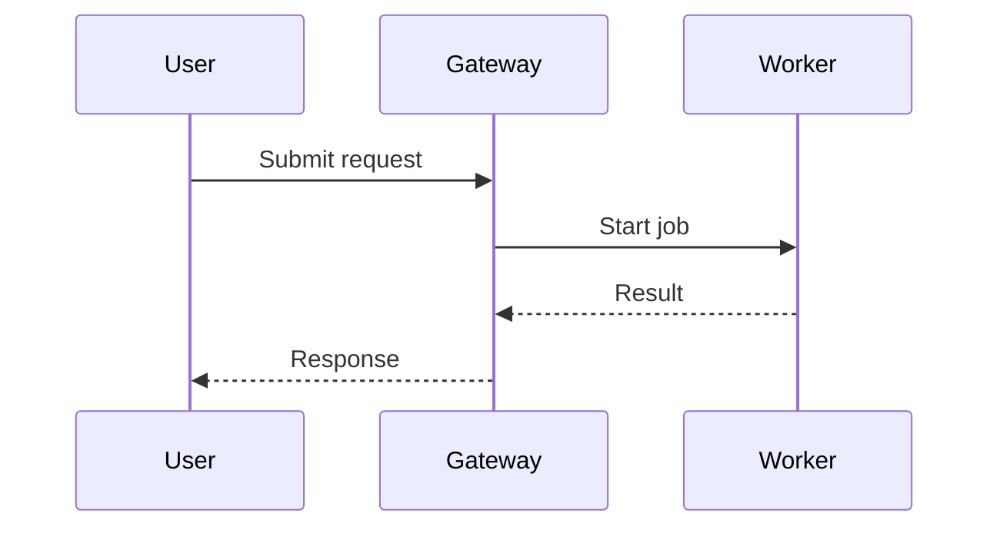
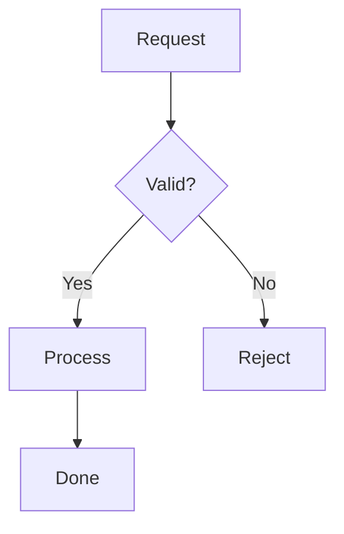
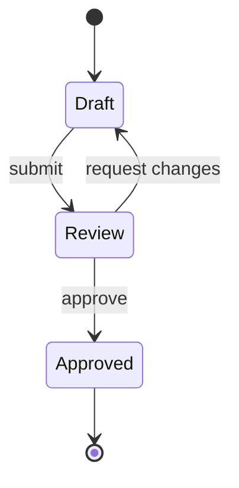
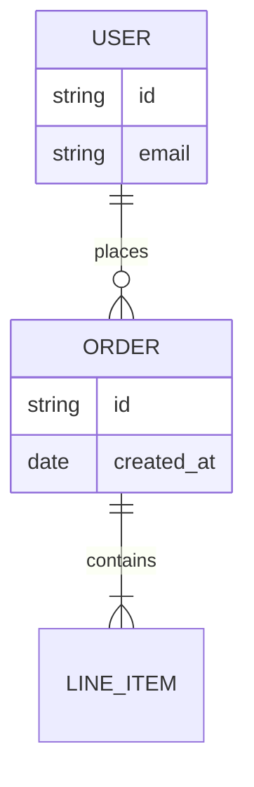
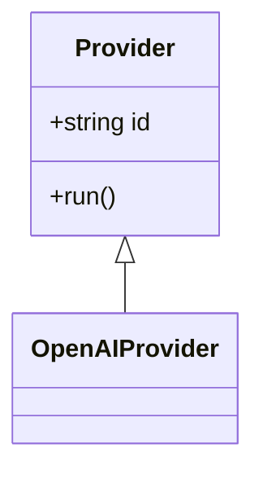
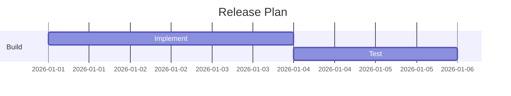
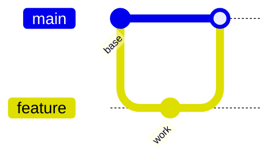
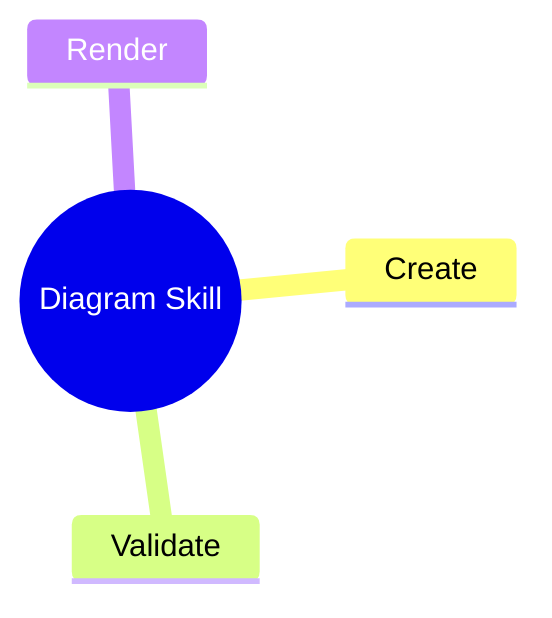
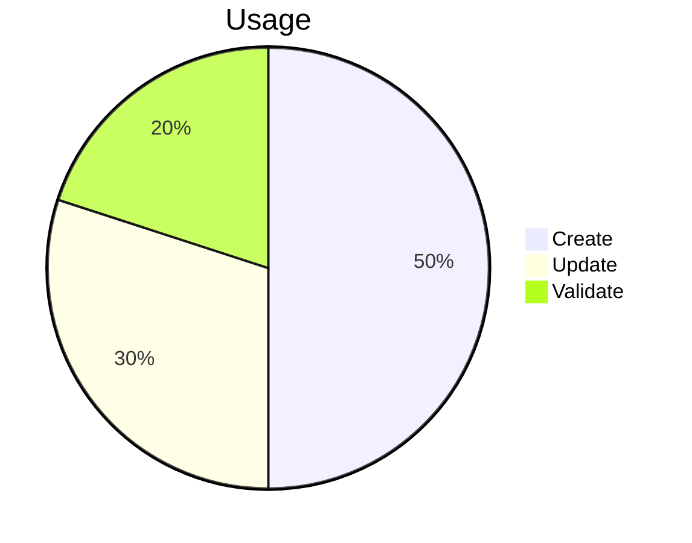

# Mermaid Type Reference

Use these examples as the starting grammar for `diagram_validate` and `diagram_create`.

## sequence

## flowchart

## state

## er

## class

## gantt

## git-graph

## mindmap

## pie

